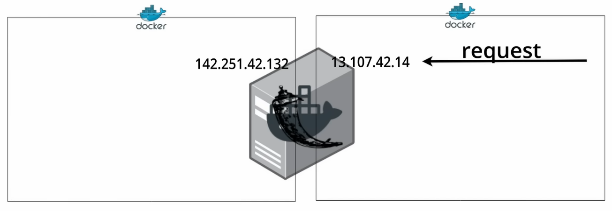

# Microservice Architecture & System Design with Python & Kubernetes

# Install
- docker [Reference to Installation Guide: `https://docs.docker.com/desktop/install/windows-install/`]
- minikube [Reference to Installation Guide: `https://minikube.sigs.k8s.io/docs/start/`]
- k9s [Reference to Installation Guide: `https://k9scli.io/topics/install/`]
- Python 3.x
- MySQL

# Tutorial

1. Creating our first service
```cmd
cd .\system_design\python\src\auth\
```
- Create a virtual environment
```cmd
python -m venv venv
```
- Activate the virtual environment
```cmd
.\venv\Scripts\activate
```
- Download libraries inside venv
```cmd
pip install pylint
pip install jedi
pip install pyjwt, jwt
pip install flask_mysqldb
```

---

2. Create a `server.py`
- Set the environment variable(s) for MySQL in venv:
```cmd
$env:MYSQL_HOST = 'localhost'
```
- Create a `init.sql`
- Download MySQL server and add it to System Path. (environment variables).
- Run command in venv:
```cmd
\Kubernetes_Python\system_design\python\src\auth> mysql -u root -p
```

```cmd
mysql> show databases;
mysql> exit
```

Now, run the same command with the `init.sql` file.
```cmd
Get-Content init.sql | mysql -u root -p
```

```cmd
mysql> show databases;
+--------------------+
| Database           |
+--------------------+
| auth               |
+--------------------+
mysql> use auth;
Database changed
mysql> show tables;
+----------------+
| Tables_in_auth |
+----------------+
| user           |
+----------------+
1 row in set (0.00 sec)

mysql> desc user;
+----------+--------------+------+-----+---------+----------------+
| Field    | Type         | Null | Key | Default | Extra          |
+----------+--------------+------+-----+---------+----------------+
| id       | int(11)      | NO   | PRI | NULL    | auto_increment |
| email    | varchar(255) | NO   |     | NULL    |                |
| password | varchar(255) | NO   |     | NULL    |                |
+----------+--------------+------+-----+---------+----------------+
3 rows in set (0.04 sec)

mysql> select * from user;
+----+------------------+-----------+
| id | email            | password  |
+----+------------------+-----------+
|  1 | anurag@gmail.com | anurag123 |
+----+------------------+-----------+
1 row in set (0.00 sec)

mysql> exit
Bye
```

`To drop the Table & Database, Run:`
```cmd
mysql -u root -p -e "DROP USER auth_user@localhost"
```

```cmd
mysql -u root -p -e "DROP DATABASE auth"
```

---

3. Write the server implementation for checking username passed in request is same as the ones in DB.

## Auth Mechanism Overview

- A gateway service that connects user to internal services residing in the K8s cluster.
- A Auth Service/scheme resides in the K8s cluster. We do Basic Authentication scheme in this project.


##  Understanding JWTs and the Auth Flow - A JSON formatted string which is base64 encoded.

It has 3 parts: <br>
    - Header (Algorithm and Token type) - key-value pair which has the signing algorithm (Asymmetric Signing Algo, Symmetric Signing Algo). Auth Service uses HS256 (HMAC with SHA-256 which is a symmetric algorithm). Our Auth Service is the one who's going to know the single private key.<br>
    - Payload (Data) - key-value pairs of data a.k.a. claims<br>
    - Signature - Takes the base64 header, payload and signs it using the signing algorithm.<br>

JWT Auth Mechanism:
<!--  -->


<!-- 
 -->

## Understanding server.run(host="0.0.0.0",port=5000,)

- 0.0.0.0 is kind of like a wild card.
- localhost is different, it is a loopback address and cannot be accessed from outside. 0.0.0.0 also includes the loopback address.
- This tells your OS to listen on all public IP's
- If you run your server inside a Docker container, then instead of setting the host to a static IP address is no good, because the Docker container's IP address will change the next time you run it. So, you enter 0.0.0.0 so that the OS/Flask application running inside the container listens to all public IP's.



A docker container can be part of 2 Docker networks where it will have two different IP addresses. So, in order for the Flask application to work in both Docker networks, we need to configure the application to listen to 0.0.0.0 .

- Freeze the requirements
```cmd
pip freeze > requirements.txt
```
---

4. Create a `Dockerfile`
- Think of an image as a filesystem snapshot which contains all the necessary dependencies to run python
- Each line should result in a construction of a single layer. For example, if our code changes then we don't need to, for example, rebuild the `pip install requirements.txt` layer, hence saving us a lot of time during build.
- Any layer that's rebuilt, the following/upper layers have to be rebuilt as well.


```cmd
docker build .
```

- Create a docker repository on DockerHub (hub.docker.com)

- Tag the Docker Image
```cmd
docker tag <image_id> anuragb98/auth:latest
```
- Push the image to the remote repository
```cmd
docker push anuragb98/auth:latest
```

# References
- https://www.youtube.com/watch?v=hmkF77F9TLw - Microservice Architecture and System Design with Python & Kubernetes