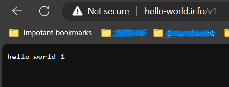
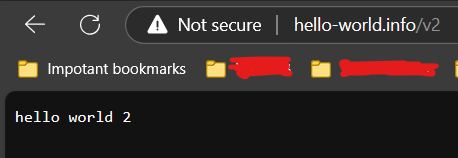

# About NodePort

In Kubernetes (K8s), a NodePort is a type of service that exposes an application running inside a cluster to the outside world. It does this by allocating a static port on each node in the cluster and forwarding traffic from that port to the service within the cluster. NodePort services are useful when you need to make your application accessible from outside the Kubernetes cluster, typically for testing or development purposes.

Here's how NodePort services work:

Allocation of a Static Port: When you create a NodePort service, Kubernetes allocates a static port number from a predefined range (usually in the range of 30000-32767) on each node in the cluster.

Routing Traffic: Traffic sent to any node's IP address on the allocated port is routed to the NodePort service within the cluster. Kubernetes handles the routing by configuring network address translation (NAT) rules on the nodes' firewall, ensuring that the traffic reaches the correct service.

Service Discovery: Inside the cluster, the NodePort service acts like any other Kubernetes service, which means it can be discovered by other pods or services using the service's DNS name or IP address and port.

External Access: Clients from outside the Kubernetes cluster can access the service by targeting any node's IP address on the allocated NodePort. The traffic is then forwarded to the appropriate service and pod.

```yaml
apiVersion: v1
kind: Service
metadata:
  name: my-nodeport-service
spec:
  selector:
    app: my-app
  type: NodePort
  ports:
    - protocol: TCP
      port: 80  # The port exposed on the service
      targetPort: 8080  # The port that the service forwards traffic to in pods

```

In this example, a NodePort service named "my-nodeport-service" is created, and it selects pods labeled with app: my-app. It exposes port 80 on all nodes, which forwards traffic to port 8080 in the pods with the matching label.

NodePort services are not recommended for production use cases where you require fine-grained control, load balancing, or secure external access. In production, you might typically use an Ingress controller or a LoadBalancer service type for more advanced networking requirements.

# Ingress and Ingress Controller

Lets define:

hello-world.info/v1 -> app1 -> app1 pod - print "hello world 1"

hello-world.info/v2 -> app2 -> app2 pod - print "hello world 2"

- `hashicorp/http-echo` -  is an in-memory web server that renders an HTML page containing the contents of the arguments provided to it. This is especially useful for demos or a more extensive "hello world" Docker application.

    OR

- Use: `jxlwqq/http-echo`

- Setup `minikube`
- Run `minikube start` after running Docker Desktop.
- Run `minikube addons enable ingress` [ingress would be available at 127.0.0.1]

- Add the following in `etc/hosts`
Make sure this is the same name as will be defined in `ingress.yaml` file.
```
# To allow the same kube context to work on the host and the container:
127.0.0.1 hello-world.info
```

- Create the pods:
```cmd
\learning_ingress> kubectl apply -f pod.yaml
```
```cmd
kubectl get pods
```
- Delete pods:
```cmd
kubectl delete pod app1
```

- Create the service
```cmd
kubectl apply -f service.yaml
```
Services (IP's) are accessible only within cluster.
```cmd
kubectl get svc
```

- Create ingress
```cmd
kubectl apply -f ingress.yaml
```
```cmd
kubectl get ing
```
```cmd
kubectl get endpoints
```
```cmd
kubectl get pods -n ingress-nginx
```

- Lastly run from a new terminal
```
minikube tunnel
```

Go to `hello-world.info/v1`


Go to `hello-world.info/v2`


# Reference
- https://www.youtube.com/watch?v=hGG8cq70XQ0 - Ingress kubernetes tutorial in Hindi with Practical Demo